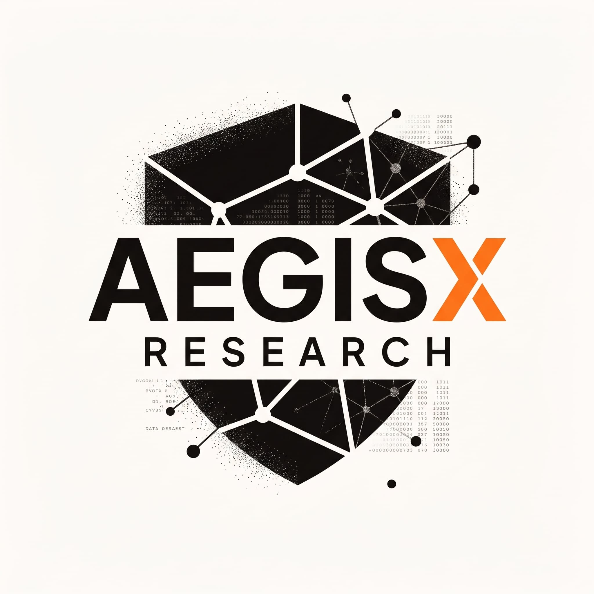

<p align="center">
  
</p>

# AegisX Skills Collection

Kumpulan **67 panduan teknis terstruktur** untuk programmer, software engineer, DevOps engineer, security engineer, dan ML engineer.


[](https://github.com/aegisxresearch/AegisX-Skills/actions/workflows/skills-validation.yml)
[](https://github.com/aegisxresearch/AegisX-Skills/actions/workflows/docs.yml)
[](./LICENSE)
[](https://aegisxresearch.github.io/AegisX-Skills/)

---

## Tentang

Koleksi panduan engineering yang ditulis dengan struktur konsisten: konsep inti, contoh kode, checklist yang dapat diverifikasi, dan referensi resmi. Cakupan: Backend API, Frontend, Mobile, Machine Learning, AI Engineering, Database, Data Engineering, DevOps, Cloud, Security, dan Programming.

Setiap skill berada di folder sendiri:

```text
skills/<nama-skill>/
├── README.md          Ringkasan: kategori, level, topik
└── <nama-skill>.md    Panduan: konsep, contoh, checklist, referensi
```

Materi ini adalah referensi engineering, bukan kode siap pakai. Contoh production-oriented harus disesuaikan dengan stack, threat model, dan kebutuhan sistem Anda.

---

## Fitur

- **67 panduan** di 10 kategori — tiap skill punya ringkasan, konsep inti, contoh, checklist, dan referensi
- **Katalog dari manifest** — `skills/manifest.json` adalah satu-satunya sumber kebenaran; README dan situs digenerate otomatis
- **Validasi otomatis di CI** — struktur, metadata, link lokal, dan placeholder diperiksa di setiap PR (`scripts/validate-skills.py`)
- **Situs dokumentasi** — MkDocs Material, di-deploy ke GitHub Pages dari `main`
- **Kategori anti-AI-slop** — skill untuk kualitas kode, dokumentasi, test, dependency, dan output agent

---

<!-- CATALOG_START -->

## Daftar Skills

Katalog ini dihasilkan secara otomatis dari [`skills/manifest.json`](./skills/manifest.json) oleh [`scripts/generate-readme.py`](./scripts/generate-readme.py). Jangan mengedit bagian ini secara manual.

### Backend API dan Realtime

| Skill | Level | Deskripsi |
|-------|-------|-----------|
| [`api-design-patterns`](./skills/api-design-patterns/) | Intermediate–Advanced | RESTful API design, pagination, versioning, rate limiting, filtering, dan sorting. |
| [`api-observability`](./skills/api-observability/) | Intermediate–Advanced | Logs, metrics, traces, SLO, dan alerting untuk API. |
| [`api-testing-strategy`](./skills/api-testing-strategy/) | Intermediate–Advanced | Unit, integration, contract, dan load testing untuk API. |
| [`auth-implementation-guide`](./skills/auth-implementation-guide/) | Intermediate–Advanced | JWT, OAuth2 + PKCE, session management, dan security checklist. |
| [`fastapi-python-backend`](./skills/fastapi-python-backend/) | Intermediate–Advanced | REST API Python: FastAPI, Pydantic v2, async SQLAlchemy, testing, dan deployment. |
| [`golang-microservices`](./skills/golang-microservices/) | Advanced | Microservices Go: boundary, concurrency, gRPC, resilience, dan observability. |
| [`graphql-api-engineering`](./skills/graphql-api-engineering/) | Intermediate–Advanced | Schema, resolver, authorization, pagination, dan query-cost controls. |
| [`message-queues-events`](./skills/message-queues-events/) | Advanced | Event contracts, idempotency, retries, DLQ, dan outbox. |
| [`node-typescript-backend`](./skills/node-typescript-backend/) | Intermediate–Advanced | Backend Node.js strictly typed: modul, validasi, error handling, dan testing. |
| [`openapi-spec-driven`](./skills/openapi-spec-driven/) | Intermediate | Contract-first API: OpenAPI 3.1, lint, codegen, dan validasi kontrak. |
| [`websocket-realtime`](./skills/websocket-realtime/) | Intermediate–Advanced | Connection lifecycle, reconnect, backpressure, dan fanout. |

### Machine Learning dan AI

| Skill | Level | Deskripsi |
|-------|-------|-----------|
| [`llm-application-engineering`](./skills/llm-application-engineering/) | Intermediate–Advanced | Structured output, tool use, safety, cost, dan fallback. |
| [`ml-evaluation-mlops`](./skills/ml-evaluation-mlops/) | Advanced | Dataset lineage, model registry, deployment, drift, dan rollback. |
| [`pytorch-training-playbook`](./skills/pytorch-training-playbook/) | Intermediate–Advanced | Training loop, mixed precision, gradient accumulation, dan debugging. |
| [`rag-pipeline-architect`](./skills/rag-pipeline-architect/) | Advanced | Chunking, embeddings, vector DB, hybrid search, dan evaluation. |

### Frontend dan Web Design

| Skill | Level | Deskripsi |
|-------|-------|-----------|
| [`accessibility-wcag`](./skills/accessibility-wcag/) | Intermediate–Advanced | Semantic HTML, keyboard UX, ARIA, WCAG, dan testing. |
| [`animation-performance-guide`](./skills/animation-performance-guide/) | Intermediate | GPU animation, will-change, dan reduced motion. |
| [`design-system-builder`](./skills/design-system-builder/) | Intermediate–Advanced | Design tokens, components, documentation, dan WCAG. |
| [`frontend-testing-playbook`](./skills/frontend-testing-playbook/) | Intermediate–Advanced | Component, integration, E2E, accessibility, dan visual tests. |
| [`microfrontends-module-federation`](./skills/microfrontends-module-federation/) | Advanced | Frontend multi-tim: Module Federation, kontrak modul, shared deps. |
| [`pwa-offline-first`](./skills/pwa-offline-first/) | Intermediate–Advanced | PWA offline-first: service worker, strategi cache, manifest, dan sync. |
| [`react-nextjs-patterns`](./skills/react-nextjs-patterns/) | Intermediate–Advanced | Server Components, App Router, Server Actions, dan state management. |
| [`responsive-layout-master`](./skills/responsive-layout-master/) | Beginner–Intermediate | Mobile-first, fluid typography, container queries, dan layout. |
| [`seo-programmatic`](./skills/seo-programmatic/) | Intermediate–Advanced | Metadata, canonical, sitemap, robots, JSON-LD, dan indexability. |
| [`web-localization-i18n`](./skills/web-localization-i18n/) | Intermediate | i18n/l10n: pluralization, Intl, RTL, locale routing, dan alur terjemahan. |
| [`web-performance-core-vitals`](./skills/web-performance-core-vitals/) | Intermediate–Advanced | LCP, INP, CLS, performance budget, dan RUM. |

### Database dan Data Engineering

| Skill | Level | Deskripsi |
|-------|-------|-----------|
| [`data-engineering-pipelines`](./skills/data-engineering-pipelines/) | Intermediate–Advanced | Batch/streaming, contracts, incremental loads, quality, dan lineage. |
| [`django-orm-advanced`](./skills/django-orm-advanced/) | Intermediate–Advanced | Django ORM: select_related/prefetch_related, F expressions, select_for_update, dan pengukuran query count. |
| [`elasticsearch-search`](./skills/elasticsearch-search/) | Intermediate–Advanced | Search relevan: mapping, analysis, query DSL, tuning, dan operasional. |
| [`mongodb-data-modeling`](./skills/mongodb-data-modeling/) | Intermediate–Advanced | Model dokumen MongoDB: embed vs reference, index, dan aggregation. |
| [`postgresql-master`](./skills/postgresql-master/) | Intermediate–Advanced | Indexing, query optimization, partitioning, dan tuning. |
| [`postgresql-query-tuning`](./skills/postgresql-query-tuning/) | Intermediate–Advanced | Tuning berbasis bukti: pg_stat_statements, EXPLAIN BUFFERS, composite/partial index, keyset pagination. |
| [`prisma-orm-playbook`](./skills/prisma-orm-playbook/) | Beginner–Intermediate | Schema, relations, CRUD, transactions, dan migrations. |
| [`redis-caching`](./skills/redis-caching/) | Intermediate–Advanced | Cache-aside, TTL, rate limiting, locks, memory, dan security. |

### Architecture dan Reliability

| Skill | Level | Deskripsi |
|-------|-------|-----------|
| [`incident-response-sre`](./skills/incident-response-sre/) | Intermediate–Advanced | Incident command, mitigation, runbooks, SLO, dan postmortems. |
| [`system-design-architect`](./skills/system-design-architect/) | Advanced | Scalability, microservices, queues, circuit breaker, dan resilience. |

### DevOps dan Cloud

| Skill | Level | Deskripsi |
|-------|-------|-----------|
| [`ci-cd-production`](./skills/ci-cd-production/) | Intermediate–Advanced | Immutable artifacts, deployment strategy, scanning, dan rollback. |
| [`docker-production-checklist`](./skills/docker-production-checklist/) | Intermediate | Multi-stage builds, non-root, health checks, dan resource limits. |
| [`github-actions-workflows`](./skills/github-actions-workflows/) | Intermediate | Workflows yang cepat dan aman: permissions, SHA pinning, caching, matrix, OIDC, reusable workflows. |
| [`gitops-kubernetes`](./skills/gitops-kubernetes/) | Advanced | GitOps dengan Argo CD/Flux: repo sumber kebenaran, drift, progressive delivery. |
| [`kubernetes-production`](./skills/kubernetes-production/) | Advanced | Probes, resources, RBAC, rollout, disruption, dan observability. |
| [`linux-cli-mastery`](./skills/linux-cli-mastery/) | Beginner–Intermediate | File operations, grep/sed/awk, proses, dan Bash scripting. |
| [`observability-prometheus-grafana`](./skills/observability-prometheus-grafana/) | Intermediate–Advanced | Prometheus + Grafana: metrik RED/USE, PromQL, alerting, dan SLO. |
| [`opentelemetry-tracing`](./skills/opentelemetry-tracing/) | Intermediate–Advanced | Distributed tracing: OTel SDK, context propagation, sampling, collector, dan korelasi log. |
| [`prometheus-alerting-slo`](./skills/prometheus-alerting-slo/) | Intermediate–Advanced | Alerting berbasis SLO: multi-window burn rate, error budget, PromQL histogram, dan routing Alertmanager. |
| [`serverless-edge-computing`](./skills/serverless-edge-computing/) | Intermediate–Advanced | Serverless & edge: function design, cold start, batasan, biaya, observability. |
| [`terraform-infrastructure`](./skills/terraform-infrastructure/) | Intermediate–Advanced | Modules, remote state, plan review, drift, dan safe changes. |

### Security

| Skill | Level | Deskripsi |
|-------|-------|-----------|
| [`api-security-hardening`](./skills/api-security-hardening/) | Intermediate–Advanced | Hardening API: OWASP API Top 10, BOLA/IDOR, authz, dan rate limiting. |
| [`cybersecurity-fundamentals`](./skills/cybersecurity-fundamentals/) | Intermediate–Advanced | OWASP Top 10, secure coding, dan penetration testing. |
| [`gdpr-data-privacy`](./skills/gdpr-data-privacy/) | Intermediate–Advanced | Privacy engineering: data mapping, consent, DSR, minimisasi, dan retention. |
| [`sast-dependency-scanning`](./skills/sast-dependency-scanning/) | Intermediate | Otomasi SCA + SAST di CI: OSV, Trivy, baseline scan, kebijakan fail per severity, dan SBOM. |
| [`secrets-management`](./skills/secrets-management/) | Intermediate–Advanced | Secret lifecycle, rotation, vault, access control, dan incident response. |
| [`security-testing-dast-sast`](./skills/security-testing-dast-sast/) | Intermediate–Advanced | SAST + DAST: Semgrep di CI, OWASP ZAP di staging, triase temuan, dan escape rate. |
| [`supply-chain-security`](./skills/supply-chain-security/) | Intermediate–Advanced | Dependency, SBOM, provenance, signing, dan artifact verification. |
| [`threat-modeling-stride`](./skills/threat-modeling-stride/) | Intermediate–Advanced | Assets, trust boundaries, STRIDE, abuse cases, dan mitigasi. |
| [`zero-trust-application-security`](./skills/zero-trust-application-security/) | Advanced | Workload identity, least privilege, segmentation, dan continuous verification. |

### Anti-AI-Slop dan Quality

| Skill | Level | Deskripsi |
|-------|-------|-----------|
| [`anti-hallucinated-dependencies`](./skills/anti-hallucinated-dependencies/) | Intermediate–Advanced | Verifikasi package, API, versi, lockfile, dan dependency necessity. |
| [`anti-slop-agent-output`](./skills/anti-slop-agent-output/) | Intermediate–Advanced | Pelaporan perubahan, test, asumsi, risiko, dan keterbatasan secara faktual. |
| [`anti-slop-code-review`](./skills/anti-slop-code-review/) | Intermediate–Advanced | Review berbasis behavior, complexity, error handling, dan evidence. |
| [`anti-slop-documentation`](./skills/anti-slop-documentation/) | Intermediate–Advanced | Klaim berbukti, contoh jujur, trade-off, dan dokumentasi terawat. |
| [`anti-slop-test-quality`](./skills/anti-slop-test-quality/) | Intermediate–Advanced | Assertion kuat, failure cases, mock boundaries, dan flake prevention. |

### Programming dan Workflow

| Skill | Level | Deskripsi |
|-------|-------|-----------|
| [`clean-architecture-ddd`](./skills/clean-architecture-ddd/) | Advanced | Clean Architecture & DDD: domain model, bounded context, ports & adapters. |
| [`git-workflow-master`](./skills/git-workflow-master/) | Beginner–Advanced | Branching, rebase, cherry-pick, bisect, worktree, dan commits. |
| [`property-based-testing`](./skills/property-based-testing/) | Intermediate–Advanced | Property-based testing: invariant, generator, shrinking, dan boundary. |
| [`typescript-advanced-patterns`](./skills/typescript-advanced-patterns/) | Intermediate–Advanced | Generics, utility types, type guards, dan design patterns. |

### Mobile Development

| Skill | Level | Deskripsi |
|-------|-------|-----------|
| [`flutter-development`](./skills/flutter-development/) | Intermediate–Advanced | Flutter production: widget, state management, platform channel, dan testing. |
| [`react-native-expo`](./skills/react-native-expo/) | Intermediate–Advanced | Aplikasi mobile RN + Expo: navigasi, state, offline, push, dan rilis. |
<!-- CATALOG_END -->

---

## Jalur Belajar

Setiap jalur menunjukkan urutan skill yang sebaiknya dipelajari. Estimasi waktu per skill ada di `difficulty_hours` di manifest.

### Web full-stack
```text
System Design (4h) -> API Design (2h) -> Auth (3h) -> PostgreSQL (3h)
-> PostgreSQL Query Tuning (3h) -> React/Next.js (3h) -> Design System (3h)
-> A11y (2h) -> Testing (3h) -> API Observability (2h) -> Docker (2h)
-> CI/CD (2h) -> GitHub Actions Workflows (2h)
Total: ~34 jam
```

### AI/ML pipeline
```text
Data Engineering (3h) -> RAG Pipeline (4h) atau LLM Application (3h)
-> MLOps (4h) -> API Observability (2h) -> OpenTelemetry Tracing (3h)
-> Security (3h)
Total: ~19-22 jam
```

### Platform & infra
```text
Threat Modeling (3h) -> Secrets (2h) -> Terraform (3h) -> Kubernetes (4h)
-> GitOps (4h) -> CI/CD (2h) -> GitHub Actions Workflows (2h)
-> SAST & Dependency Scanning (2h) -> Supply-Chain (2h)
-> Incident Response (2h)
Total: ~26 jam
```

### Security engineer
```text
Threat Modeling (3h) -> Cybersecurity Fundamentals (3h) -> Auth (3h)
-> API Security Hardening (3h) -> SAST & Dependency Scanning (2h)
-> Security Testing DAST+SAST (3h) -> Zero Trust (3h) -> GDPR (2h)
Total: ~22 jam
```

### Observability & SRE
```text
API Observability (2h) -> OpenTelemetry Tracing (3h)
-> Prometheus + Grafana (3h) -> Prometheus Alerting & SLO (3h)
-> Kubernetes Production (4h) -> Incident Response (2h)
Total: ~17 jam
```

### Mobile
```text
React Native (3h) atau Flutter (3h) -> Offline/state (3h) -> Push (2h)
-> Security (3h) -> Observability (3h) -> Release (2h)
Total: ~16-19 jam
```

---

## Cara Menggunakan

```bash
git clone https://github.com/aegisxresearch/AegisX-Skills.git
cd AegisX-Skills
```

Baca `README.md` di folder skill yang dibutuhkan, lalu panduan utama (`<nama-skill>.md`) untuk contoh dan checklist.

Situs dokumentasi: https://aegisxresearch.github.io/AegisX-Skills/

---

## FAQ

**Bagaimana cara menambahkan skill baru?**
Ikuti langkah di bagian Kontribusi: buat folder `skills/<nama-skill>/`, tambahkan `README.md` + panduan utama, daftarkan di `skills/manifest.json`, lalu jalankan `python3 scripts/generate-readme.py` dan `python3 scripts/validate-skills.py`.

**Apakah contoh kode siap dipakai produksi?**
Contoh diberi label jujur (`runnable`, `illustrative`, `pseudo-code`). Semua contoh harus disesuaikan dengan stack, threat model, dan kebutuhan sistem Anda.

**Bagaimana CI memastikan kualitas?**
Workflow **Skills Validation** menjalankan validator, ruff, actionlint, dan memastikan README serta konfigurasi MkDocs sinkron dengan manifest di setiap PR. Workflow **Docs** membangun situs secara strict dan mendeploy-nya ke GitHub Pages.

**Apa itu kategori Anti-AI-Slop?**
Kategori berisi skill untuk mencegah kualitas rendah dari AI agent: review kode berbasis bukti, kualitas test, verifikasi dependency, dokumentasi yang jujur, dan pelaporan output agent yang faktual.

**Bagaimana skill direview agar tidak basi?**
Setiap skill memiliki `last_reviewed` di manifest; workflow bulanan **Skill Review Reminder** membuka issue saat ada skill yang melewati interval review (180 hari).

---

## Kontribusi

1. Buat `skills/<nama-skill>/` dengan `README.md` + `<nama-skill>.md`
2. Daftarkan di `skills/manifest.json` (id, category, level, summary, tags, overview, guide, status, prerequisites, languages, difficulty_hours)
3. Jalankan `python3 scripts/generate-readme.py && python3 scripts/validate-skills.py`
4. Submit PR -- CI akan validasi otomatis dan auto-merge jika semua hijau

---

## License

MIT License.

---

**[AegisX Research](https://github.com/aegisxresearch)** -- Dokumentasi engineering yang ditulis oleh engineer, untuk engineer. Konten ini dihasilkan dari pengalaman lapangan, bukan dari template AI.
